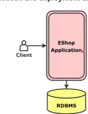
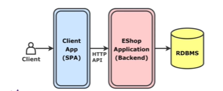
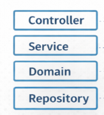
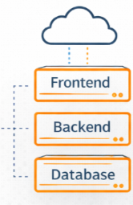

# 🛍️ eShop Monolith

Uma arquitetura de e-commerce monolítica desacoplada, demonstrando os princípios de separação de camadas (3-tier) e abordagem API-First para criar aplicações escaláveis e mantíveis.

## 📋 O Problema: Acoplamento Forte entre UI, Lógica e Dados

Quando o núcleo de negócios e o banco de dados estão fortemente acoplados à interface de usuário, surgem diversos problemas críticos:

### Problemas de Arquitetura

- **Efeito Dominó**: Uma mudança no formato de uma data no banco de dados quebra a interface, pois ela esperava o formato antigo
- **Dificuldade de Manutenção**: Atualizar o design exige modificar códigos complexos de lógica, tornando o processo lento e custoso
- **Impossibilidade de Escalar**: Criar uma versão mobile requer refazer quase tudo, pois a lógica está "presa" na interface web

### Impacto na Experiência do Usuário (UX)

- **Performance Lenta**: UIs acopladas fazem requisições pesadas e diretas, causando travamentos quando o banco demora
- **Feedback Pobre**: Dependência de respostas síncronas deixa o usuário vendo telas brancas e carregamentos infinitos
- **Inconsistência Visual**: Mudanças não se propagam uniformemente, criando uma experiência confusa e amadora

## ✅ Solução: Arquitetura Desacoplada com 3-Tier

### Padrão de Desacoplamento

A arquitetura de três camadas (3-tier) estabelece o padrão fundamental para mitigar o acoplamento sistêmico:

- **Segregação de Responsabilidades**: A aplicação é dividida em camadas de Apresentação, Lógica de Negócios e Dados
- **Independência de Componentes**: Cada camada opera de forma independente e especializada
- **API-First**: A API atua como peça central de inteligência, orquestrando requisições de múltiplos clientes (React, Mobile, etc.) através de contratos bem definidos

### 🎯 Design Final: Antes e Depois

#### ❌ Versão Inicial (Fortemente Acoplada)

*Problema: Todas as camadas são fortemente acopladas, dificultando manutenção e escalabilidade*

#### ✅ Versão com Padrão Aplicado (Desacoplada)

*Solução: Camadas independentes com API como intermediária, permitindo múltiplos clientes e fácil manutenção*

#### Principais Mudanças

| Aspecto | Antes | Depois |
|--------|-------|--------|
| **Acoplamento** | UI ↔ Lógica ↔ Dados | UI ↔ API ↔ Dados |
| **Clientes** | Apenas Web | Web, Mobile, Desktop, Terceiros |
| **Manutenção** | Difícil e Arriscada | Simples e Segura |
| **Testabilidade** | Baixa | Alta |
| **Escalabilidade** | Limitada | Ilimitada |

### Layer vs Tier

| Conceito | Descrição |
|----------|-----------|
| **Layer** | Organização lógica da aplicação (separação de responsabilidades) |
| **Tier** | Organização física da aplicação (onde os componentes executam) |

**Referência**: [Layer vs Tier na Prática - Dennis Rojas](https://www.linkedin.com/pulse/layer-vs-tier-na-pr%C3%A1tica-dennis-rojas-k95hf/)