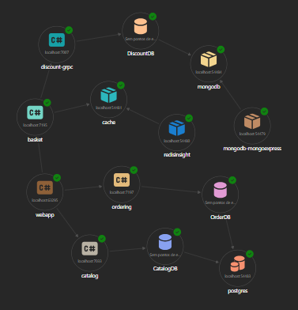

# 🛍️ eShop Evolution

Repositório demonstrativo da evolução arquitetural de uma aplicação e-commerce. O sistema evoluiu de um monólito para uma **Arquitetura de Microservices**, composta por **3 APIs independentes** com comunicação assíncrona via **Redis Streams**.

---

## 🏗️ Arquitetura Atual: Microservices com Event-Driven Communication

A aplicação foi refatorada e segregada em quatro serviços autônomos, cada um com sua responsabilidade bem definida:

- **Catalog API**: Gerenciamento e consulta do catálogo de produtos.
- **Basket API**: Gestão do carrinho de compras e itens do usuário.
- **Discount API**: Aplicação de descontos e cupons.
- **Ordering API**: Processamento e efetivação de pedidos.

Essa separação permite escalar cada serviço independentemente (Horizontal Scaling) e isolar falhas.

## 🤝 RaptorMediator => Padrão Mediator

Para orquestrar as intenções de negócio dentro de cada serviço, adotamos o **Padrão Mediator**.

O Mediator desacopla o recebimento da requisição (geralmente no Controller) de sua execução (Domain Handler).
- **Resumo:** Em vez de `Controller -> Service Class`, temos `Controller -> Mediator -> Handler`.
- **Vantagem:** Facilita a implementação de *Cross-Cutting Concerns* (Logs, Validações, Transações, Retries) através de Pipelines, sem sujar a regra de negócio.

## 🚀 gRPC: Alta Performance entre Serviços

Utilizamos **gRPC** para a comunicação síncrona crítica entre a **Basket API** e a **Discount API**, garantindo validação de descontos em tempo real com mínima latência.

- **Performance Superior:** Baseado em **HTTP/2** e **Protocol Buffers**, oferece performance até 10x superior a REST/JSON.
- **Contrato-First:** A definição da API via arquivos `.proto` assegura interoperabilidade e tipagem forte.
- **Arquitetura do Fluxo:**
  - **Discount API (Server):** Microserviço autônomo que detém as regras de negócio de descontos.
  - **Basket API (Client):** Consome o serviço de desconto transparentemente através de um cliente gRPC gerado.
- **Detalhes Técnicos e de Negócio:**
  - **HTTP/2:** Permite multiplexação de requisições sobre uma única conexão TCP, reduzindo overhead.
  - **Protocol Buffers:** Formato de serialização binário eficiente, menor que JSON/XML, otimizado para velocidade.
  - **Streaming Bidirecional:** Capacidade de enviar e receber múltiplos dados em uma única chamada, ideal para cenários de tempo real.
  - **Validação de Descontos:** A Basket API envia o carrinho para a Discount API via gRPC, que retorna os descontos aplicáveis, tudo em milissegundos.

## 📨 Redis Streams: Event-Driven Architecture

Implementamos comunicação assíncrona baseada em eventos usando **Redis Streams** para desacoplar a **Basket API** da **Ordering API**.

### Por que Redis Streams?

- **Mensageria Nativa:** Não requer infraestrutura adicional (já usamos Redis para cache)
- **Consumer Groups:** Permite múltiplas instâncias consumindo mensagens em paralelo
- **Persistência:** Mensagens são armazenadas até serem processadas e confirmadas (ACK)
- **Performance:** Latência ultrabaixa comparado a message brokers tradicionais
- **Simplicidade:** Mais simples que RabbitMQ/Kafka para cenários de comunicação entre poucos serviços

### Fluxo de Eventos

```
User Checkout → BasketAPI → [Redis Stream: orders-stream] → OrderingAPI → PostgreSQL
                    ↓                                              ↓
              Publish Event                              Create Order (Consumer)
```

**Componentes Implementados:**

1. **Integration Events** (`AppShared`):
   - `OrderCreatedEvent`: Contrato de evento com dados do pedido
   - `OrderItemDto`: DTO para itens do pedido

2. **Event Bus Abstraction**:
   - `IEventBus`: Interface genérica para publicação
   - `RedisEventBus`: Implementação com StackExchange.Redis
   - Serialização JSON, error handling e structured logging

3. **Producer (BasketAPI)**:
   - `CheckoutBasketCommandHandler` publica evento após checkout
   - Configurado via Aspire com referência ao Redis

4. **Consumer (OrderingAPI)**:
   - `RedisStreamWorker`: BackgroundService que consome eventos
   - Consumer Group para processamento distribuído
   - ACK automático após criação bem-sucedida do pedido
   - Retry logic e dead letter queue strategy

### Benefícios da Abordagem Event-Driven

✅ **Desacoplamento Temporal:** BasketAPI não precisa esperar OrderingAPI processar
✅ **Resiliência:** Mensagens persistidas mesmo se OrderingAPI estiver offline
✅ **Escalabilidade:** Consumer groups permitem múltiplas instâncias paralelas
✅ **Observabilidade:** Logs estruturados em toda pipeline de eventos
✅ **Rastreabilidade:** Message IDs únicos para tracking end-to-end

---

## 🔮 Possíveis Evoluções

### 🎯 Curto Prazo (1-3 meses)

#### 1. Outbox Pattern
Implementar o padrão Outbox para garantir consistência eventual entre o banco de dados e eventos:
- Tabela `Outbox` no BasketAPI para armazenar eventos pendentes
- Background worker que publica eventos da Outbox para Redis
- Transação atômica: salvar no DB + salvar na Outbox

**Benefício:** Evita perda de eventos em caso de falha após commit do DB

#### 2. Saga Pattern para Checkout
Implementar Saga Orchestrator para coordenar o fluxo completo de checkout:
- **Etapas:** Validar Estoque → Reservar Itens → Processar Pagamento → Criar Pedido
- **Compensações:** Rollback automático em caso de falha em qualquer etapa
- **Ferramentas:** MassTransit ou implementação custom com Redis Streams

**Benefício:** Transações distribuídas confiáveis sem 2PC

#### 3. API Gateway com YARP
Já temos o YarpGateway implementado, mas podemos evoluir com:
- Rate Limiting por cliente/endpoint
- Request/Response caching
- Circuit Breaker patterns
- Authentication/Authorization centralizada (JWT)
- API Versioning

#### 4. Event Sourcing no Ordering
Migrar OrderingAPI para Event Sourcing:
- Eventos: `OrderCreated`, `OrderPaid`, `OrderShipped`, `OrderCancelled`
- Event Store (Marten ou EventStoreDB)
- Projeções para queries otimizadas

**Benefício:** Auditoria completa + possibilidade de reconstruir estado

---

### 🚀 Médio Prazo (3-6 meses)

#### 5. CQRS com Read/Write Models Separados
Separar modelos de leitura e escrita:
- **Write Side:** Entity Framework Core com PostgreSQL
- **Read Side:** Projeções materializadas em MongoDB ou Redis
- Sincronização via eventos (já temos a base com Redis Streams)

**Benefício:** Performance de queries + escalabilidade independente

#### 6. Observabilidade Completa
Implementar stack de observabilidade moderna:
- **Distributed Tracing:** OpenTelemetry + Jaeger/Zipkin
- **Metrics:** Prometheus + Grafana
- **Logging:** Serilog + Elasticsearch + Kibana (ELK Stack)
- **Correlação:** TraceId em todos os logs e eventos

#### 7. Service Mesh com Istio/Linkerd
Adicionar service mesh para:
- Mutual TLS automático entre serviços
- Traffic management (canary deployments, A/B testing)
- Observability out-of-the-box
- Retry e circuit breaker políticas centralizadas

#### 8. Cache Inteligente Multi-Camadas
Evoluir estratégia de cache:
- **L1 (In-Memory):** Cache local com invalidação por TTL
- **L2 (Redis):** Cache distribuído compartilhado
- **Cache-Aside + Write-Through:** Estratégias híbridas por use case
- **Cache Warming:** Pre-load de dados críticos no startup

---

### 🌟 Longo Prazo (6-12 meses)

#### 9. Migração para Kubernetes
Containerização completa e orquestração:
- **Containerização:** Docker multi-stage builds otimizados
- **Kubernetes:** Deployment, Services, ConfigMaps, Secrets
- **Helm Charts:** Empacotamento e versionamento
- **ArgoCD:** GitOps para continuous deployment
- **HPA:** Horizontal Pod Autoscaler baseado em métricas custom

#### 10. Event-Driven Workflow Engine
Sistema de workflows complexos baseado em eventos:
- **Ferramentas:** Temporal.io ou Elsa Workflows
- **Use Cases:** 
  - Processamento de pedidos multi-etapas
  - Notificações em cadeia (email, SMS, push)
  - Integrações com parceiros externos

#### 11. Feature Flags & A/B Testing
Sistema de feature toggles para releases controladas:
- **Launch Darkly** ou **Unleash**
- Rollout gradual de features (5% → 25% → 100%)
- A/B testing de algoritmos de recomendação
- Kill switches para desabilitar features problemáticas

#### 12. Machine Learning Integration
Integração de modelos de ML:
- **Recomendação de Produtos:** Collaborative Filtering
- **Previsão de Demanda:** LSTM/Prophet para forecast
- **Detecção de Fraude:** Anomaly detection em checkouts
- **MLOps:** Versionamento de modelos, A/B testing, monitoring

#### 13. Multi-Tenancy & White-Label
Suporte a múltiplos tenants:
- **Database Per Tenant:** Isolamento total
- **Schema Per Tenant:** Isolamento lógico
- **Row-Level Security:** Compartilhamento de tabelas
- **Customização:** Temas, logos, domínios personalizados

#### 14. GraphQL Federation
Evoluir de REST para GraphQL federado:
- **Apollo Federation:** Subgraphs por domínio
- **Schema Stitching:** Unificação de schemas
- **Benefícios:** Clients decidem estrutura de resposta, menos over-fetching

---

## 📊 Métricas de Sucesso

Para medir o impacto das evoluções:

- **Performance:** P95 latency < 200ms em todos os endpoints
- **Disponibilidade:** SLA 99.9% (máximo 43min downtime/mês)
- **Escalabilidade:** Suporte a 10.000 req/s com auto-scaling
- **Reliability:** Error rate < 0.1%
- **MTTR:** Mean Time To Recovery < 15 minutos

---

*Saímos de uma arquitetura tier para uma arquitetura modular, evoluímos para microservices com event-driven communication, e estamos prontos para cloud-native patterns.*


