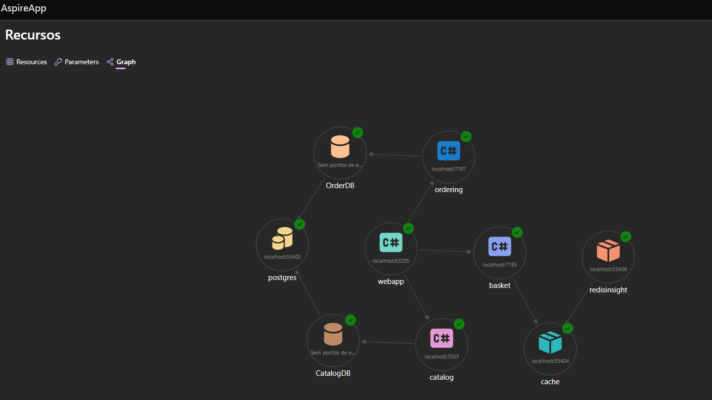

# 🛍️ eShop Evolution

Repositório demonstrativo da evolução arquitetural de uma aplicação e-commerce. O sistema evoluiu de um monólito para uma **Arquitetura de Microservices**, composta por **3 APIs independentes**.

---

## 🏗️ Nova Arquitetura: Microservices

A aplicação foi refatorada e segregada em três serviços autônomos, cada um com sua responsabilidade bem definida:

- **Catalog API**: Gerenciamento e consulta do catálogo de produtos.
- **Basket API**: Gestão do carrinho de compras e itens do usuário.
- **Ordering API**: Processamento e efetivação de pedidos.

Essa separação permite escalar cada serviço independentemente (Horizontal Scaling) e isolar falhas.

## 🤝 RaptorMediator => Padrão Mediator

Para orquestrar as intenções de negócio dentro de cada serviço, adotamos o **Padrão Mediator**.

O Mediator desacopla o recebimento da requisição (geralmente no Controller) de sua execução (Domain Handler).
- **Resumo:** Em vez de `Controller -> Service Class`, temos `Controller -> Mediator -> Handler`.
- **Vantagem:** Facilita a implementação de *Cross-Cutting Concerns* (Logs, Validações, Transações, Retries) através de Pipelines, sem sujar a regra de negócio.

*Saimos de uma arquitura tier para uma arquitura modular e agora atingimos a maturidade em microservices.*

