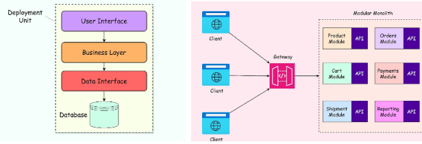

# 🛍️ eShop Monolith

Repositório demonstrativo da evolução arquitetural de uma aplicação e-commerce, migrando de uma estrutura legada para um monólito modular moderno.

---

## 🔄 Evolução: N-Tier ➔ Modular Monolith

Realizamos a migração de uma arquitetura em camadas técnicas (**N-Tier**) para um **Modular Monolith**. 

Diferente da abordagem anterior, agora organizamos o código por **contextos de negócio** (Features/Módulos) em vez de camadas horizontais (UI, BLL, DAL), garantindo que cada domínio tenha sua própria lógica e dados isolados.

### 🛠️ Tecnologias Utilizadas

*   **Plataforma:** .NET 9
*   **Orquestração:** [.NET Aspire](https://learn.microsoft.com/en-us/dotnet/aspire/get-started/aspire-overview)
*   **Banco de Dados:** PostgreSQL
*   **Frontend:** Blazor / WebApp
*   **Módulos de Domínio:** Catalog, Basket, Ordering

---

### 🗄️ Separação Lógica de Dados (Schema Separation)

A técnica de separação por schemas é utilizada em monólitos que seguem uma jornada natural de evolução rumo ao padrão de microserviços. 

Isso garante que cada módulo tenha seu próprio schema dedicado, isolando as tabelas e definindo fronteiras claras.

> [!TIP]
> Essa técnica, quando aplicada sob a ótica do negócio, é conhecida como **Bounded Contexts** (Contextos Delimitados), um pilar fundamental do Domain-Driven Design (DDD).

#### 🟢 Prós
*   **Isolamento de Dados**: Tabelas de módulos diferentes não se misturam.
*   **Facilidade de Migração**: Preparação ideal para uma futura extração para microserviços independentes.
*   **Acoplamento Zero**: Evita que desenvolvedores criem "joins" acidentais entre domínios distintos.
*   **Segurança**: Permite controle de acesso refinado no nível do banco de dados.

#### 🔴 Contras
*   **Complexidade de Schema**: Mudanças estruturais podem exigir orquestração entre módulos.
*   **Disputa de Recursos**: Como compartilham a mesma instância do banco, pode haver competição por locks ou conexões.

---

### ⚖️ Comparativo da Abordagem Modular

| Categoria | Detalhes |
| :--- | :--- |
| **✅ Alta Coesão** | Toda a lógica de uma funcionalidade reside dentro do seu respectivo módulo. |
| **✅ Manutenibilidade** | Alterações em um módulo têm impacto isolado, reduzindo o risco de regressões. |
| **✅ Limites Claros** | Contratos bem definidos entre módulos impedem a "Grande Bola de Lama". |
| **❌ Complexidade** | Exige maior disciplina na definição das fronteiras e comunicação entre módulos. |
| **❌ Curva de Aprendizado** | Mudança de mentalidade necessária: de organização técnica para funcional. |
| **❌ Duplicação** | Em alguns casos, aceita-se pequena duplicação de modelos para garantir o desacoplamento. |

---

### 🖼️ Arquitetura Final

Saimos de uma arquitetura em camadas (tier) para uma arquitetura modularizada:

